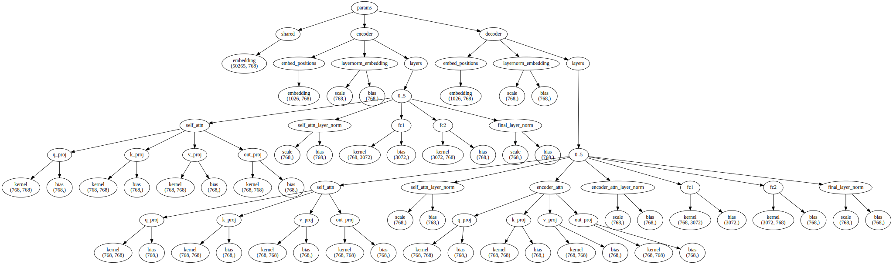
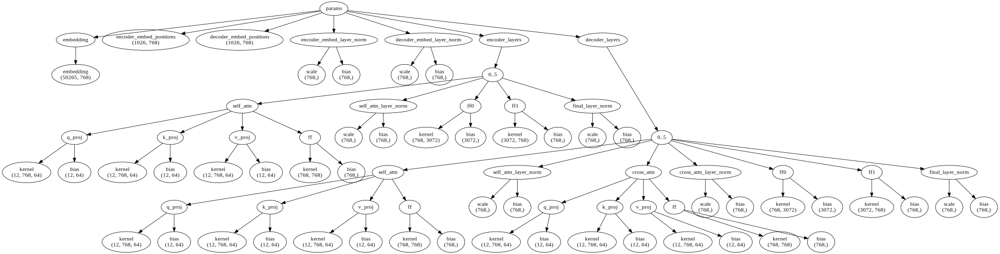

# JAX Implementation of bart-base

## 1. Motivation

This project is a JAX implementation of the [bart-base](https://arxiv.org/abs/1910.13461) model. It is developed with two objectives in mind:

(1) To examine the consistency between description and implementation of the BART model;

(2) To demonstrate how Transformer-based models can be implemented in JAX.

In addition to the regular implementation, we also implemented the model [in a single line of Python code](https://twitter.com/ayaka14732/status/1507955631109869574), by virtue of JAX's functional-style API.

This project is inspired by [hyunwoongko/transformer](https://github.com/hyunwoongko/transformer). Nevertheless, the code is written entirely on my own.

## 2. Environment Setup

(1) Create a Cloud TPU VM v3-8 with TPU software version v2-nightly20210914

(2) Install Python 3.10

(3) Create a virtual environment

```sh
python3.10 -m venv ./venv
. ./venv/bin/activate
```

(4) Install JAX with TPU support

```sh
pip install -U pip
pip install -U wheel
pip install "jax[tpu]==0.3.5" -f https://storage.googleapis.com/jax-releases/libtpu_releases.html
```

(5) Install TPU version of Tensorflow

```sh
wget https://gist.github.com/ayaka14732/a22234f394d60a28545f76cff23397c0/raw/e6c6ffea91b45a146189b52fea7155b1305bf78e/tensorflow-2.8.0-cp310-cp310-linux_x86_64.whl.0
wget https://gist.github.com/ayaka14732/a22234f394d60a28545f76cff23397c0/raw/e6c6ffea91b45a146189b52fea7155b1305bf78e/tensorflow-2.8.0-cp310-cp310-linux_x86_64.whl.1
cat tensorflow-2.8.0-cp310-cp310-linux_x86_64.whl.0 tensorflow-2.8.0-cp310-cp310-linux_x86_64.whl.1 > tensorflow-2.8.0-cp310-cp310-linux_x86_64.whl
pip install tensorflow-2.8.0-cp310-cp310-linux_x86_64.whl
rm -f tensorflow-2.8.0-cp310-cp310-linux_x86_64.whl*
```

(6) Install other required Python packages

```sh
pip install -r requirements.txt
```

## 3. Architecture

- [Dropout function](lib/dropout.py)
- [Layer Norm](lib/fwd_layer_norm.py)
- [Embedding](lib/fwd_embedding.py)
- [Linear](lib/fwd_linear.py)
- [Attention](lib/fwd_attention.py)
- [Transformer Encoder](lib/fwd_transformer_encoder.py)
- [Transformer Decoder](lib/fwd_transformer_decoder.py)
- [Transformer](lib/fwd_transformer.py)

## 4. Parameters

### 4.1. Overview

Parameter-related operations are implemented in the `lib/param_utils` directory. Notably, three functions, `flax2jax`, `pt2jax` and `jax2flax` are implemented, to allow any conversions between PyTorch, Flax and JAX implementation.

| from\to | PyTorch | Flax | JAX |
| :- | :-: | :-: | :-: |
| PyTorch | - | `save_pretrained` | `pt2jax` |
| Flax | `save_pretrained` | - | `flax2jax` |
| JAX | `jax2flax` + `save_pretrained` | `jax2flax` | - |

`save_pretrained` is a function provided by the Hugging Face Transformers library, so that users can save the model in one framework and reload it in another framework. For instance, the following code saves a Flax model and reload it as a PyTorch model:

```python
with tempfile.TemporaryDirectory() as tmpdirname:
    model_flax.save_pretrained(tmpdirname)
    model_pt = BartForConditionalGeneration.from_pretrained(tmpdirname, from_flax=True)
```

### 4.2. Original checkpoint

The original model implementation and checkpoints are available in the [pytorch/fairseq](https://github.com/pytorch/fairseq/blob/main/examples/bart/README.md) library. The model parameters in Hugging Face Transformers are the same with the original checkpoint, so we only focus on the model parameters in Hugging Face Transformers (see below).

### 4.3. Flax BART model in Hugging Face Transformers



```
shared
    embedding (50265, 768)
encoder
    embed_positions
        embedding (1026, 768)
    layernorm_embedding
        scale (768,)
        bias (768,)
    layers
        0..5
            self_attn
                q_proj
                    kernel (768, 768)
                    bias (768,)
                k_proj
                    kernel (768, 768)
                    bias (768,)
                v_proj
                    kernel (768, 768)
                    bias (768,)
                out_proj
                    kernel (768, 768)
                    bias (768,)
            self_attn_layer_norm
                scale (768,)
                bias (768,)
            fc1
                kernel (768, 3072)
                bias (3072,)
            fc2
                kernel (3072, 768)
                bias (768,)
            final_layer_norm
                scale (768,)
                bias (768,)
decoder
    embed_positions
        embedding (1026, 768)
    layernorm_embedding
        scale (768,)
        bias (768,)
    layers
        0..5
            self_attn
                q_proj
                    kernel (768, 768)
                    bias (768,)
                k_proj
                    kernel (768, 768)
                    bias (768,)
                v_proj
                    kernel (768, 768)
                    bias (768,)
                out_proj
                    kernel (768, 768)
                    bias (768,)
            self_attn_layer_norm
                scale (768,)
                bias (768,)
            encoder_attn
                q_proj
                    kernel (768, 768)
                    bias (768,)
                k_proj
                    kernel (768, 768)
                    bias (768,)
                v_proj
                    kernel (768, 768)
                    bias (768,)
                out_proj
                    kernel (768, 768)
                    bias (768,)
            encoder_attn_layer_norm
                scale (768,)
                bias (768,)
            fc1
                kernel (768, 3072)
                bias (3072,)
            fc2
                kernel (3072, 768)
                bias (768,)
            final_layer_norm
                scale (768,)
                bias (768,)
```

### 4.4. JAX parameters in this project



```
embedding
    embedding (50265, 768)
encoder_embed_positions (1026, 768)
decoder_embed_positions (1026, 768)
encoder_embed_layer_norm
    scale (768,)
    bias (768,)
decoder_embed_layer_norm
    scale (768,)
    bias (768,)
encoder_layers
    0..5
        self_attn
            q_proj
                kernel (12, 768, 64)
                bias (12, 64)
            k_proj
                kernel (12, 768, 64)
                bias (12, 64)
            v_proj
                kernel (12, 768, 64)
                bias (12, 64)
            ff
                kernel (768, 768)
                bias (768,)
        self_attn_layer_norm
            scale (768,)
            bias (768,)
        ff0
            kernel (768, 3072)
            bias (3072,)
        ff1
            kernel (3072, 768)
            bias (768,)
        final_layer_norm
            scale (768,)
            bias (768,)
decoder_layers
    0..5
        self_attn
            q_proj
                kernel (12, 768, 64)
                bias (12, 64)
            k_proj
                kernel (12, 768, 64)
                bias (12, 64)
            v_proj
                kernel (12, 768, 64)
                bias (12, 64)
            ff
                kernel (768, 768)
                bias (768,)
        self_attn_layer_norm
            scale (768,)
            bias (768,)
        cross_attn
            q_proj
                kernel (12, 768, 64)
                bias (12, 64)
            k_proj
                kernel (12, 768, 64)
                bias (12, 64)
            v_proj
                kernel (12, 768, 64)
                bias (12, 64)
            ff
                kernel (768, 768)
                bias (768,)
        cross_attn_layer_norm
            scale (768,)
            bias (768,)
        ff0
            kernel (768, 3072)
            bias (3072,)
        ff1
            kernel (3072, 768)
            bias (768,)
        final_layer_norm
            scale (768,)
            bias (768,)
```

## 5. Training

Should prepend EOS before every sentence in `dst`.

## 6. Evaluation

## 7. Generation

Typical generation process of the BART model involves the input sequences and their masks. The model generates the output autoregressively.

While greedy decoding is the simplest generation algorithm for autoregressive language models, other algorithms like beam search and sampling can improve the quality of the generated sentences and therefore improve performance. In this project, we refrain from implementing these generation algorithms and leave the work to the Hugging Face Transformers library.

However, generation functions in the Hugging Face Transformers library are coupled with the implementation of their original models, which makes them inaccessible for customized models. To tackle this problem, we convert our model to a regular Hugging Face Transformer model.

## 8. Inconsistency Analysis

We analyse the inconsistency between the description of the BART model in the literature and the actual BART implementation.

In section 2.1 of the BART paper, the authors stated that BART uses the standard Transformer architecture except for the activation function and initialization. We examine other notable differences between BART and the standard Transformer.

### 8.1. BART has learnable parameters for Layer Norm

Layer Norm is calculated by this formula:

$$
y = \frac{x-\textbf{E}[x]}{\sqrt{\mathrm{Var}[x]+\epsilon}} * \gamma + \beta
$$

In which $\gamma$ and $\beta$ are learnable parameters.

In section 7 of the Transformer paper, it is said that the Transformer architecture is implemented in the [tensorflow/tensor2tensor](https://github.com/tensorflow/tensor2tensor) library. In the library, [`LayerNormalization`](https://github.com/tensorflow/tensor2tensor/blob/c81d770/tensor2tensor/models/research/residual_shuffle_exchange.py#L40-L41) does not contain learnable parameters.

### 8.2. BART has extra bias parameters for _Q_, _K_ and _V_

Similar to Layer Norm, BART also has has extra bias parameters for $Q$, $K$ and $V$. It seems that the authors of the BART paper are unaware of this, since they refer $Q$, $K$ and $V$ as 'projection matrix' instead of 'linear layers' in the Section 3.4 of the BART paper.

### 8.3. Positional encoding is learned rather than fixed

In Section 3.5 of the Transformer paper, it is said that the positional encoding is fixed and is calculated by sine and cosine functions:

$$
PE_{(pos,2i)} = \sin(pos/10000^{2i/d_\mathrm{model}})
$$

$$
PE_{(pos,2i+1)} = \cos(pos/10000^{2i/d_\mathrm{model}})
$$

In BART, however, positional embedding is a learned parameter. The authors of BART seems to be aware of this, since they wrote in Section 3.4 of BART that they were updating the BART positional embeddings in the first training stage of machine translation.

### 8.4. Positional encoding has an offset of 2

In BART, the positional encoding has an offset of 2, which means that the 0-th token uses the second positional encoding, the first token uses the third positional encoding, an so on. The first two positions of the positional encoding is never used.

### 8.5. BART uses tied word embeddings

BART uses tied word embeddings on top of the output of the final layer of the decoder. In regular Transformer architecture, the layer is a linear layer used for classification. In BART, however, it is the transpose of the word embedding.

### 8.6. BART has extra dropout after activation

BART has extra dropout after activation, while Transformer do not have this.

### 8.7. BART uses an additional decoder start token

TODO: Confirm that Transformer does not use this.

Related: <https://stackoverflow.com/q/64904840>

### 8.8. BART tokenizer encodes the first word of a sentence differently

```python
from transformers import BartTokenizer

tokenizer = BartTokenizer.from_pretrained('facebook/bart-base')
inputs = tokenizer(['go go go'], return_tensors='np')
inputs.input_ids.tolist()
```

TODO: Does Chinese BART have this issue?

Related: <https://discuss.huggingface.co/t/bpe-tokenizers-and-spaces-before-words/475>

## 9. Notes on Implementation

This section records the problems we encountered during my implementation of the BART model and the final solutions.

### 9.1. bart-large has intrinsic problems

This issue is reported in [huggingface/transformers#15559](https://github.com/huggingface/transformers/issues/15559). As a consequence, we only focus on implementing bart-base in this project, and not bart-large.

### 9.2. `np.std` and `torch.std` are different

```python
import torch

x = torch.tensor([[-1., 1.]])

print(x.std(-1).numpy())  # [1.4142135]
print(x.numpy().std(-1))  # [1.]
```

It is because in `np.std` the denominator is _n_, while in `torch.std` it is _n_-1. See [pytorch/pytorch#1854](https://github.com/pytorch/pytorch/issues/1854) for details.

However, for the standard deviation in Layer Norm, the denominator is always n in either PyTorch or NumPy.

### 9.3. Computations on TPU are in low precision by default

JAX uses bfloat16 for matrix multiplication on TPU by default, even if the data type is float32. See [google/jax#9973](https://github.com/google/jax/issues/9973) for details.

```python
import jax.numpy as np

print(4176 * 5996)  # 25039296

a = np.array(0.4176, dtype=np.float32)
b = np.array(0.5996, dtype=np.float32)
print((a * b).item())  # 0.25039297342300415
```

For neural network training, however, reducing the accuracy is worthwhile because it can significantly reduce the training time, according to Tom's comments in the above issue.

### 9.4. Weight matrix of linear layer is transposed in PyTorch

Weight matrix of linear layer is transposed in PyTorch, but not in Flax. Therefore, to convert model parameters between PyTorch and Flax, it is always needed to transpose the weight matrices.

In Flax:

```python
import flax.linen as nn
import jax.numpy as np
import jax.random as rand
linear = nn.Dense(5)
key = rand.PRNGKey(42)
params = linear.init(key, np.zeros((3,)))
print(params['params']['kernel'].shape)  # (3, 5)
```

In PyTorch:

```python
import torch.nn as nn
linear = nn.Linear(3, 5)
print(linear.weight.shape)  # (5, 3), not (3, 5)
```

This can cause sneaky bugs for bart-base, in which the _Q_, _K_, _V_ matrices are square matrices. If the matrices are not transposed, there will be no shape error, but the result will be totally incorrect.

### 9.5. Layer Norm of PyTorch and Flax are slightly different
