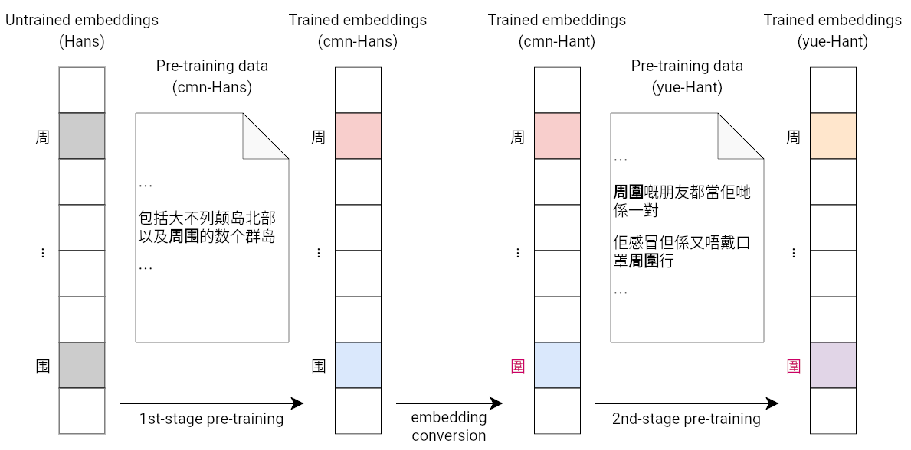
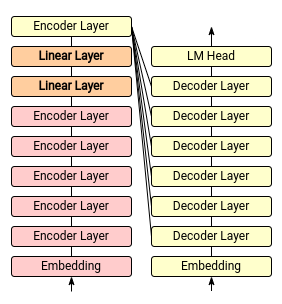

# TransCan: A Novel Approach to English-Cantonese Machine Translation

**Abstract:** In this paper, I propose TransCan, a novel BART-based approach to English-Cantonese machine translation. Cantonese is a low-resource language with limited English-Cantonese parallel data, which makes the English-Cantonese translation a challenging task. However, Cantonese is grammatically similar to the high-resource Mandarin Chinese language and has a relatively large amount of monolingual data. To exploit these two features of Cantonese, I first perform a second-stage pre-training of the Chinese BART model on a monolingual Cantonese corpus to obtain a Cantonese BART model. Consequently, I devised a simple yet novel model architecture, linking the beginning part of the English BART model and the end part of the Cantonese BART model with two simple linear projection layers, and fine-tuned the model on a small English-Cantonese parallel corpus. The resulting model outperformed the state-of-the-art commercial machine translation product by 11.8 BLEU. The source code is publicly available on GitHub.

This research is supported by Cloud TPUs from Google's [TPU Research Cloud](https://sites.research.google/trc/about/) (TRC).

This document is incomplete. It is still in its early stages and will be extensively revised in the next few days.

## Table of Contents

* [Results](#results)
* [Introductions](#introductions)
* [Definitions](#definitions)
* [Overview](#overview)
* [Pre-Training](#pre-training)
    * [1st-Stage Pre-Training](#1st-stage-pre-training)
    * [Embedding Conversion](#embedding-conversion)
    * [2nd-Stage Pre-Training](#2nd-stage-pre-training)
* [Fine-Tuning](#fine-tuning)
    * [Architectural Modifications](#architectural-modifications)
    * [1st-Stage Fine-Tuning](#1st-stage-fine-tuning)
    * [2nd-Stage Fine-Tuning](#2nd-stage-fine-tuning)
* [Appendix A: The Wakong Algorithm](#appendix-a-the-wakong-algorithm)
* [Source Code: Repositories](#source-code-repositories)
* [Source Code: Steps to reproduce](#source-code-steps-to-reproduce)

<!-- Created by https://github.com/ekalinin/github-markdown-toc -->

## Results

| Model | BLEU | File |
| :- | :-: | :- |
| **This Model** | **28.6** | [`results-bart.txt`](results-bart.txt) |
| Baidu Translate | 16.8 | [`results-baidu.txt`](results-baidu.txt) |
| Bing Translate | 15.5 | [`results-bing.txt`](results-bing.txt) |

- Source sentences: [`test.en.txt`](https://github.com/ayaka14732/wordshk-parallel-corpus/blob/v1/plus15/test.en.txt)
- References: [`test.yue.txt`](https://github.com/ayaka14732/wordshk-parallel-corpus/blob/v1/plus15/test.yue.txt)

## Introductions

Popularity

Existing systems:

1. Commercial machine translation products: The architecture of the system is not known, but it can be demonstrated that it uses Mandarin as an intermediary and makes extensive use of rule-based methods. Such a system is inaccurate and error-prone, and cannot fully translate Mandarin sentences into Cantonese, which usually results in an incongruous mixture of Mandarin and Cantonese that is offensive to Cantonese speakers;
1. Existing approaches for low-resource language translation: Cannot exploit the two features that Cantonese is grammatically closer to the high-resource Mandarin Chinese language and has a relatively large amount of monolingual data.

In view of the large market demand for English-Cantonese translations, this study establishes a new baseline system and calls for future researchers to further push the boundary of the research in this field.

My main contributions are as follows:

1. I propose a novel approach to English-Cantonese machine translation that highly outperforms existing systems;
1. For English-Cantonese machine translation systems, I proposed the first English-Cantonese machine translation dataset to evaluate their performance;
1. For low-resource languages with relatively large mono-lingual data, I proposed a method to perform a second-stage pre-training to utilise the pre-trained models for a similar high-resource language;
1. For low-resource machine translation, I proposed a novel model architecture and fine-tuning method that utilise two monolingual pre-trained models and a small amount of parallel training data to obtain a high performance;
1. For Chinese NLP tasks, I proposed a method to convert a model trained on a Simplified Chinese dataset to a Traditional Chinese model without any training involved;
1. For the pre-training of large language models, I proposed a mathematically rigorous masking algorithm to generate the training objective.

## Definitions

Chinese:

Chinese Character:

Simplified Chinese:

Traditional Chinese:

Differences in habits of using Chinese characters in different regions

Conversion of SC/TC: StarCC

Mandarin:

Cantonese:

Written Cantonese:

Current status of Cantonese (i.e. why Cantonese is a low resource language)

Cantonese-specific Chinese characters

## System Overview

The model for machine translation is produced in two steps: pre-training and fine-tuning.

1. Pre-training
    1. **1st-stage pre-training**: Pre-train a Mandarin (simplified Chinese) model _(already been done in [fnlp/bart-base-chinese](https://huggingface.co/fnlp/bart-base-chinese))_
    1. **Embedding conversion**: Convert the embedding to traditional Chinese and add Cantonese vocabulary
    1. **2nd-stage pre-training**: Pre-train the model to fit Cantonese (traditional Chinese) data
2. Fine-tuning
    1. **Architecture modification**: Take the beginning part of the English BART model and the end part of the Cantonese BART model and connect them with two newly-initialised linear projection layers
    1. **1st-stage fine-tuning**: Fine-tune the two newly-initialised linear projection layers
    1. **2nd-stage fine-tuning**: Fine-tune the whole model

## Pre-Training



TODO: add explanation

Cantonese is grammatically close to Mandarin, and has a relatively large amount of monolingual data. Therefore, it was natural to think that one can pre-train a Mandarin model in the first stage and then further pre-train the model in the second stage to obtain a Cantonese model.

Translation of the above sentences:

- 包括大不列颠岛北部以及**周围**的数个群岛 (meaning: including the northern part of the island of Great Britain and several **surrounding** archipelagos)
- **周圍**嘅朋友都當佢哋係一對 (meaning: All the friends **around me** think they are a couple)
- 佢感冒但係又唔戴口罩**周圍**行 (meaning: He has the flu, but he walks **around** without a mask)

### 1st-Stage Pre-Training

A pre-trained Mandarin BART model has already been proposed in [fnlp/bart-base-chinese](https://huggingface.co/fnlp/bart-base-chinese). Therefore, I have to decide whether to use the pre-trained BART model proposed in that paper or to pre-train a Mandarin BART model from scratch.

There are advantages and disadvantages to both approaches. If I train the BART model from scratch, I can make the necessary modifications to the pre-training data and tokeniser to prepare for the second-stage pre-training. For example, I can use StarCC to convert the pre-training data to traditional Chinese and add Cantonese-specific Chinese characters to the tokeniser in advance. If I utilise the existing BART model, I have to make direct modifications to the embedding, which will be more challenging. However, this would save pre-training resources.

In response to the call for environmental research, and to demonstrate the feasibility of converting a simplified Chinese model to a traditional Chinese model by modifying the embedding, I decided to use the existing pre-trained Mandarin BART model.

### Embedding Conversion

<!-- 首先，tokeniser是在简体中文上训练的，不适合繁体中文文本，因此我需要將tokeniser vocabulary中的簡體字轉為繁體。其次，一些字符只在粵語中使用，需要在tokeniser中添加這些字符。 -->

**Tokeniser:** Convert Simplified Chinese to Traditional Chinese on a word-level.

1. Convert the tokens of the original tokeniser from Simplified Chinese to Traditional Chinese, while keeping the corresponding embeddings fixed
1. Given Cantonese datasets, calculate how many Cantonese-specific characters are missing in the original tokenizer, and add them to the vocabulary
1. Randomly initialise new embeddings for new tokens

(TODO) Elaborate according to [ayaka14732/bert-tokenizer-cantonese](https://github.com/ayaka14732/bert-tokenizer-cantonese).

### 2nd-Stage Pre-Training

**Dataset:** The model is trained on the LIHKG dataset, which consists of 172,937,863 sentences. The average length of the sentence is 17.8 characters. Each sentence is padded or truncated to 64 tokens.

**Pre-training objective**

I adopted the text-infilling objective described in the original BART paper. As the original description is unclear, I propose a robust text-infilling algorithm as follows: Wakong (TODO) (Appendix A)

**Initialisation**: The model is initialised from the Chinese (Mandarin) BART model, with the embedding layer modified as the description above. Extra tokens are randomly initialised. Using weight tying.

**Training details:** I utilise the SGD optimiser with a learning rate of 0.03 and adaptive gradient clipping 0.1, and the batch size is 640. It is trained for 7 epochs and 61,440 steps. The training takes 44.0 hours on Google Cloud TPU v4-16.

## Fine-Tuning

### Architectural Modifications



The TransCan model is based on the BART base model. The first part of the model is the encoder embedding and all but the last layers of the encoder, which are initialised from the English BART model. The second part of the model is the decoder embedding, the last encoder layer and all layers of the decoder, which are initialised from the Cantonese BART model. Two linear projection layers are inserted between the two parts of the model.

### 1st-Stage Fine-Tuning

(TODO) Add more details

**Initialisation**: In each linear layer, the weights are randomly initialised using Lecun normal initialiser, while the biases are set to zeros.

**Training details:** Only train the two linear projection layers and fix the other parts. The intuition is that ...

### 2nd-Stage Fine-Tuning

(TODO) Add more details

**Training details:** The whole model is fine-tuned. I utilise the AdamW optimiser with a learning rate of 1e-5. Batch size is 32 and trained for 8 epochs.

## Appendix A: The Wakong Algorithm

1\. Constants

```math
\mathsf{proposedMaskRate} = 0.188
```

```math
\mathsf{poissonRate} = 4.2
```

```math
\mathsf{maxSpanLen} = 10
```

2\. `probsList`

```math
\mathsf{probsList} = \left[ \mathrm{normalise} \left(  \mathsf{probs} \left[ {:}\,i \right] \right) \mathrm{for} \; i \; \mathrm{in} \left[2, \; .. , \; \mathsf{maxSpanLen} + 1 \right] \right]
```

```math
\mathsf{probs} = \left[ \Pr(X=i) \; \mathrm{for} \; i \; \mathrm{in} \left[ 0, \; .., \; \mathsf{maxSpanLen} + 1 \right] \right]
```

```math
X \sim \mathrm{Pois}(\mathsf{poissonRate})
```

3\. `determineShouldMaskLen`

```math
\mathsf{determineShouldMaskLen} \left( \mathsf{seqLen} \right) =
\begin{cases}
    \lceil x \rceil, & \text{if} \; \omega < p \\
    \lfloor x \rfloor, & \text{otherwise}
\end{cases}
```

```math
\omega \sim \mathrm{U} \left( 0, 1 \right)
```

```math
x = \mathsf{seqLen} * \mathsf{proposedMaskRate}
```

```math
p = x - \lfloor x \rfloor
```

4\. `generateSpans`

```math
\mathsf{generateSpans} \left( m \right) = \mathrm{shuffle} \left( \mathrm{anamorphism} \left( f \right) \left( m \right) \right)
```

```math
f \left( \mathsf{remainedLen} \right) =
\begin{cases}
    \mathrm{Nothing}, & \text{if} \; \mathsf{remainedLen} \leq 0 \\
    \left( \mathsf{span}, \; \mathrm{Just} \left( \mathsf{remainedLen} - \mathsf{span} - 1 \right) \right), & \text{otherwise}
\end{cases}
```

```math
\mathsf{span} \sim \mathrm{Categorical} \left( [0, \; .., \; n + 1], \; \mathsf{probsList} \left[ n - 1 \right] \right)
```

```math
n = \min \left( \mathsf{maxSpanLen}, \; \mathsf{remainedLen} \right)
```

5\. `distributeInsertPoses`

```math
\mathsf{distributeInsertPoses} \left( \mathsf{xs} \right) = f \left( \mathsf{xs}, \; 0 \right)
```

```math
f \left( n, \; \mathsf{xs} \right) =
\begin{cases}
    \mathsf{\left[ \, \right]}, & \text{if} \; \mathrm{empty} \left( \mathsf{xs} \right) \\
    \left[ \left( p + n, \; s \right) \right] + f \left(n + s + 1, \; \mathsf{ys} \right), & \text{otherwise}
\end{cases}
```

```math
\left[ \left( p, s \right) \right] + \mathsf{ys} \leftarrow \mathsf{xs}
```

6\. `randomAddOne`

```math
\mathsf{randomAddOne} \left( \mathsf{xs} \right) = \begin{cases}
    \mathsf{xs}, & \text{if} \; \omega < 0.5 \\
    \left[ (p + 1, s) \; \mathrm{for} \; (p, s) \; \mathrm{in} \; \mathsf{xs} \right], & \text{otherwise}
\end{cases}
```

```math
\omega \sim \mathrm{U} \left( 0, 1 \right)
```

7\. `wakong`

```math
\mathsf{wakong} \left( \mathsf{seqLen} \right) = \mathsf{randomAddOne} \left( \mathsf{distributeInsertPoses} \left( \mathrm{zip} \left( \mathsf{absInsertPoses}, \; \mathsf{spans} \right) \right) \right)
```

```math
\mathsf{absInsertPoses} = \mathrm{sort} \left( X \right)
```

```math
X = X_{1, \; .., \; \mathsf{nSpans}} \sim \mathrm{DiscreteUniform} \left[ 0, \; \mathsf{nPossibleInsertPoses} - 1 \right]
```

```math
\left( \forall \; i, j \in \left\{ 1, \; .., \; \mathsf{nSpans} \right\}, X_i \ne X_j \right)
```

```math
\mathsf{nPossibleInsertPoses} = \mathsf{seqLen} - \mathrm{sum} \left( \mathsf{spans} \right) - \mathsf{nSpans} + 1
```

```math
\mathsf{nSpans} = \mathrm{len} \left( \mathsf{spans} \right)
```

```math
\mathsf{spans} = \mathsf{generateSpans} \left( \mathsf{shouldMaskLen} \right)
```

```math
\mathsf{shouldMaskLen} = \mathsf{determineShouldMaskLen} \left( \mathsf{seqLen} \right)
```

## Source Code: Repositories

TransCan consists of multiple repositories:

- [ayaka14732/bart-base-jax](https://github.com/ayaka14732/bart-base-jax): Base model architecture
- [ayaka14732/bert-tokenizer-cantonese](https://github.com/ayaka14732/bert-tokenizer-cantonese): Conversion of the embedding
- [ayaka14732/lihkg-scraper](https://github.com/ayaka14732/lihkg-scraper): Data preparation for the 2nd-stage pre-training
- [ayaka14732/wakong](https://github.com/ayaka14732/wakong): Training objective for the 2nd-stage pre-training
- [ayaka14732/bart-base-cantonese](https://github.com/ayaka14732/bart-base-cantonese): Scripts for the 2nd-stage pre-training
- [CanCLID/abc-cantonese-parallel-corpus](https://github.com/CanCLID/abc-cantonese-parallel-corpus): Data for fine-tuning
- [ayaka14732/wordshk-parallel-corpus](https://github.com/ayaka14732/wordshk-parallel-corpus): Data for fine-tuning and evaluation
- [ayaka14732/TransCan](https://github.com/ayaka14732/TransCan): Scripts for fine-tuning and evaluation

Model weights:

- 2nd-stage pre-training: [Hugging Face Hub](https://huggingface.co/Ayaka/bart-base-cantonese)
- 1st-stage fine-tuning: [Google Drive](https://drive.google.com/file/d/1MX0LYW5jhB72g3F_WAKQm1nZVQyuD_nl/view)
- 2nd-stage fine-tuning: [Google Drive](https://drive.google.com/file/d/1IfsLd_KDnYO7nUqN0JcHoy2oLif2u4V6/view)

Training details on W&B:

- 2nd-stage pre-training: [`1j7zs802`](https://wandb.ai/ayaka/bart-base-cantonese/runs/1j7zs802)
- 1st-stage fine-tuning: [`3nqi5cpl`](https://wandb.ai/ayaka/en-kfw-nmt/runs/3nqi5cpl)
- 2nd-stage fine-tuning: [`2ix84gyx`](https://wandb.ai/ayaka/en-kfw-nmt-2nd-stage'/runs/2ix84gyx)

## Source Code: Steps to Reproduce

The experiment is conducted on Google Cloud TPU v4-16, and the results can be reproduced with the same setup. Alternatively, the results can be reproduced on any setup with two hosts, each with four default devices (e.g. two hosts with 4 GPU devices on each host). These scripts can also be easily modified to run on other environment setups to produce similar results, but the results would not be exactly the same.

```sh
# Clone source code and datasets
git clone https://github.com/ayaka14732/TransCan.git
git clone https://github.com/CanCLID/abc-cantonese-parallel-corpus.git
git clone https://github.com/CanCLID/wordshk-parallel-corpus.git

# set environment variables
cd TransCan
export EXTERNAL_IP=...  # the IP address of another host, e.g.: 10.130.0.27
echo $EXTERNAL_IP > external-ips.txt

# 1st-stage fine-tuning
git checkout fine-tune-1st-stage
python convert_params.py
./startpod python finetune.py

# 2nd-stage fine-tuning
git checkout fine-tune-2nd-stage
./startpod python 2_finetune.py

# Generate results
python 3_predict.py
python compute_bleu.py results-bart.txt

# Compare with Bing Translator
export TRANSLATE_KEY=...
export ENDPOINT=...
export LOCATION=...
python translate_bing.py
python compute_bleu.py results-bing.txt

# Compare with Baidu Translator
export BAIDU_APP_ID=...
export BAIDU_APP_KEY=...
python translate_baidu.py
python compute_bleu.py results-baidu.txt --fix-hai
```
